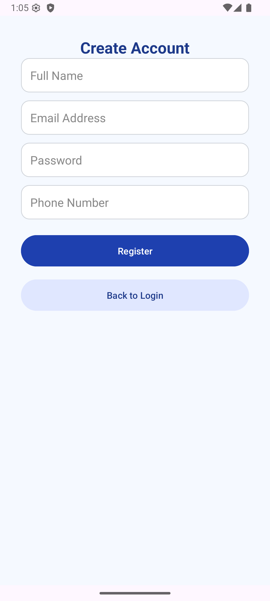

# Assignment 1 – Artificial Intelligence (Android App with Firebase)

**Semester B • Second Year • B.Sc. in Computer Science**

---

##  Overview

This assignment implements a basic Android application with user authentication and data storage using **Firebase**. The project includes:

- Modern UI with **3 fragments**: Login, Register, and Home
- Firebase **Authentication** for login/register
- Firebase **Realtime Database** to store and retrieve a user's personal description
- Modern design using **ConstraintLayout**, custom rounded inputs, and consistent styling

---

##  App Structure

- Code View
  

###  Login Screen

- User enters **email + password**
- On successful login → navigates to Home
- If user does not exist → shows error

---

###  Register Screen

- User inputs: **Name**, **Email**, **Password**, **Phone**
- On success → new user is added to Firebase DB under `users/{uid}`
- Navigates to Home screen

---

###  Home Screen

- Displays **"User Description"** section
- User can:
    - Enter and **save a description** to Firebase
    - **Load the saved description**
    - **Logout** (and return to login screen)

---

##  Technologies Used

- **Android Studio** (Java)
- **Firebase Authentication**
- **Firebase Realtime Database**
- **ConstraintLayout** + Modern UI styling
- **Navigation Component** for fragment transitions

---

## How to Run

1. Open the project in **Android Studio**
2. Connect your Firebase project:
    - Enable **Authentication → Email/Password**
    - Enable **Realtime Database**
3. Run the app on an emulator or device

---

## Author

| Name           | Role                                |
|----------------|-------------------------------------|
| Yakov Ben-Hamo | Full logic, Firebase integration, design |

---

## Notes

- App uses **UID** to associate data with users
- Input is validated before registration
- All screens are **fully responsive**
- Built 100% from scratch with clean, readable code

---

##  Screenshots

Place screenshots in `res/` or project root and update paths above accordingly.
